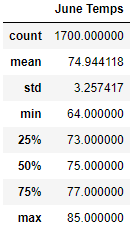
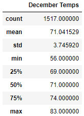
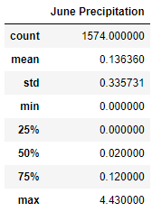
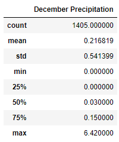

# surfs_up

## Overview
### Purpose
We use SQLAlchemy to read and query sqlite files for an analysis of weather in Oahu, Hawaii.  We are looking at temperatures in the months of June and December to see the viability of a surf and ice cream shop in the area.

## Results
### Tables

Above is a statistical analysis of the temperature readings in Fahrenheit taken in June and December across several years.

### Analysis
Looking at the data above, we can see:
* December has lower numbers at each quartile, average, and extrema
* The high temp of each month is very close to the same temperature, but December's low temp is almost 10 degrees cooler than June's
* The sample size of June is 10% larger than that of December
* The standard deviation of December is 0.5 degrees larger
* The mean is very close to the median in each month

## Summary
### Conclusion
December is consistently cooler than June; in fact the supermajority of December days are colder than the average June day.  However, the temperatures in December are themselves more inconsistent- the IQR is larger (by one degree), the standard deviation is larger (by half of a degree), and the range is larger (by 6 degrees).  That is to say, the temperature will vary more widely in December, and outliers will be more likely.

On average, both months will be quite comfortable, a little warmer than 70 degrees on an average day.  In addition, about half of the days will be warmer than that, and no reading in either month went over 85 degrees.  It seems this is ideal weather for a treat like ice cream: just above room temperature, but never reaching body temperature.  It also seems that ice cream can do this well all year round.

### Additional Query
It would be interesting to look at March and September as well, to see if the other seasons are comparable. 
I would also be interesting to look at precipitation rates, to see if Oahu has a "Rainy Season" and to see how much worse the rainfall in that season is.

Let's explore this here.  These tables describe rainfall in each month in inches.

 

It seems days in December have, on average, 50% more rainfall than those in June.
